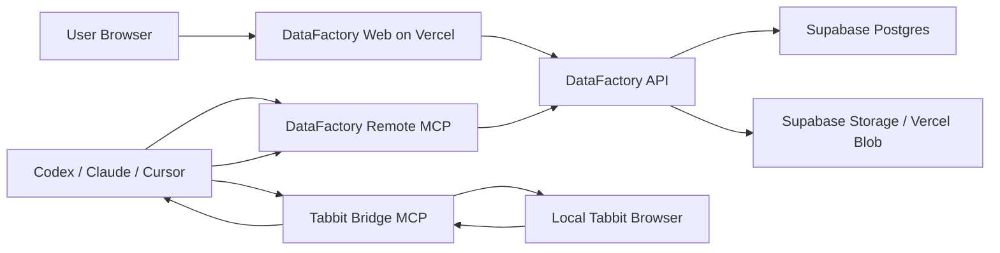

# DataFactory SaaS Migration Plan

## Target Architecture

DataFactory is the hosted SaaS control plane. It stores users, workspaces, shop environments, field rules, screenshots, collection runs, and records.

Tabbit stays local because it depends on the user's browser session, cookies, logged-in e-commerce accounts, and visual-clicking environment.



## Core Product Flow

1. User logs in to DataFactory.
2. User creates a workspace and shop environment.
3. User adds field rules in the detail table.
4. Codex reads field rules from DataFactory Remote MCP.
5. Codex sends the planned task to Tabbit Bridge MCP.
6. Tabbit uses the local logged-in browser to collect values.
7. Codex writes collection records back to DataFactory Remote MCP.
8. DataFactory table and dashboard display the newest records.

## Current Local API Shape

These local endpoints are intentionally close to the future Remote MCP tool surface:

- `GET /shops`
- `GET /shops/:shopId/rules`
- `GET /records?shopId=taobao`
- `GET /collection-runs`
- `POST /collection-runs`
- `POST /collection-records`
- `POST /write-record` compatibility alias
- `GET /state` and `PUT /state` local demo state sync

## Future Remote MCP Tools

- `list_shops`
- `get_field_rules`
- `create_collection_run`
- `write_collection_record`
- `list_collection_records`
- `update_field_rule`
- `calibrate_shop`

## Multi-Tenant Rules

Every data row must carry `workspace_id`.

Every user-facing query must filter by:

```text
workspace_id IN current_user_memberships
```

For the MVP, one workspace can have many users, many shops, many field rules, many runs, and many records.

## What Stays Local

Tabbit Bridge MCP and the Tabbit Browser stay on the user's machine.

Do not move e-commerce browser automation to Vercel. It would lose user cookies and increase anti-fraud risk.

## What Moves to Vercel

- React frontend
- DataFactory API routes
- Remote MCP HTTP endpoint
- Auth callbacks
- Signed upload URLs for screenshots

